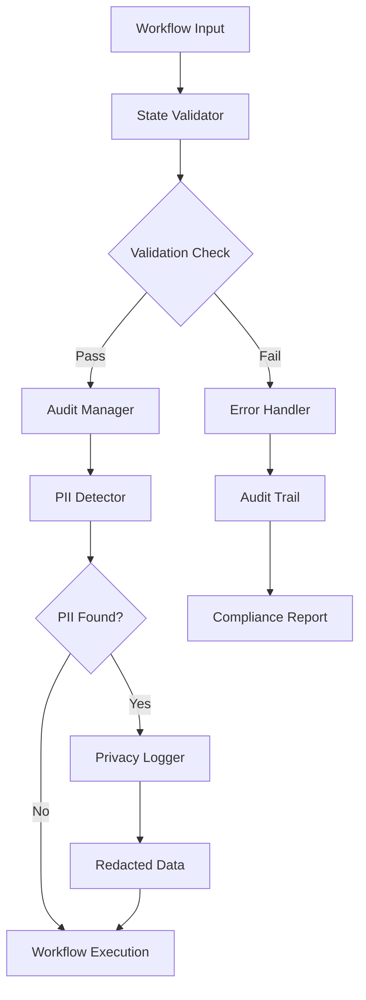
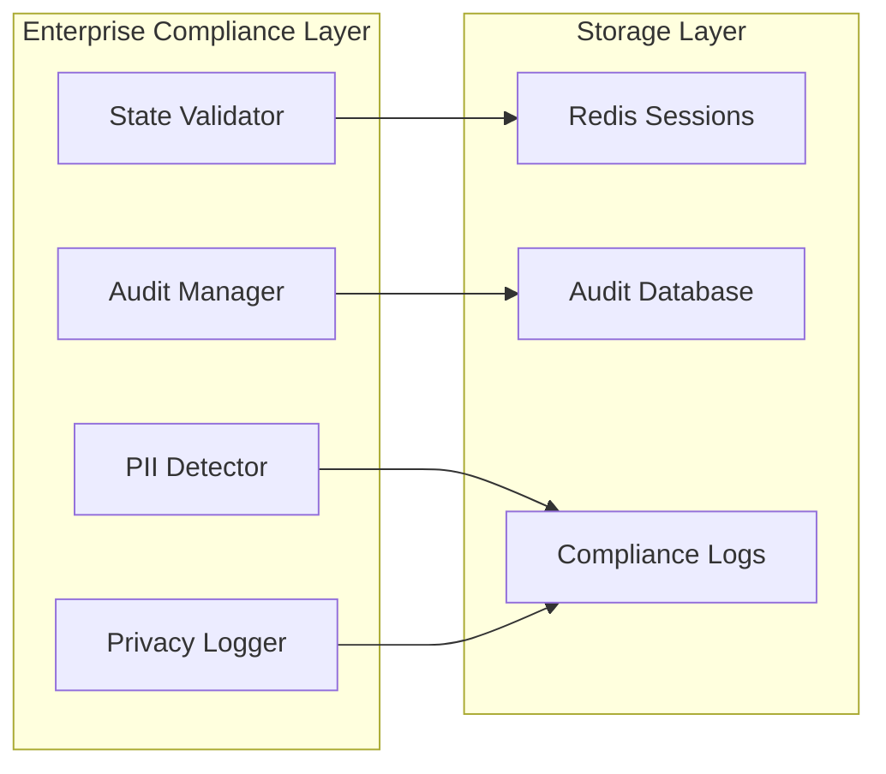
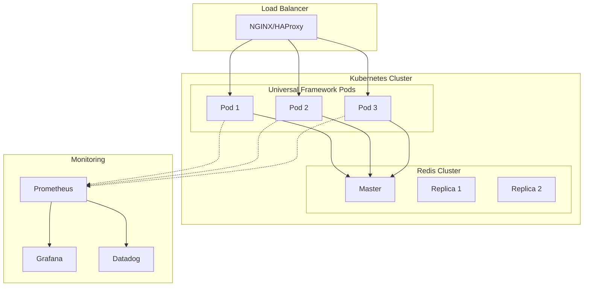
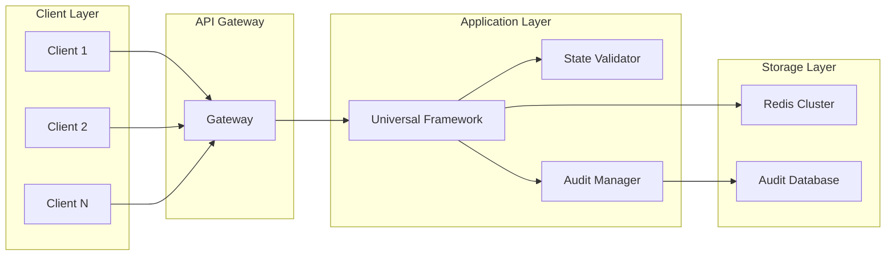
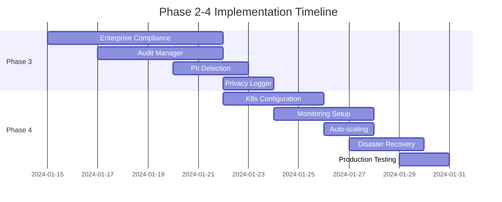

# Universal Multi-Agent System Framework
# Phase 2-4 Implementation Plan: Production Remediation & Enterprise Readiness

## Executive Summary

This comprehensive implementation plan outlines the remediation strategy for Phases 2-4 of the Universal Multi-Agent System Framework, focusing on production stability, enterprise compliance, and scalable architecture. The plan builds upon completed Phase 1 defensive programming fixes and addresses critical production readiness requirements.

**Current Status**: Phase 1 defensive programming fixes completed successfully with 86+ state access patterns made defensive across primary workflow components.

**Target Completion**: 4-6 weeks with parallel execution streams

**Risk Level**: Medium-High (Production critical system)

---

## Phase Overview

### Phase 2: Secondary Workflow Components & API Layer (Week 1-2)
**Status**: ✅ **COMPLETED** - As documented in priority_action_plan.md
- [x] workflow/orchestrator.py defensive programming
- [x] api/routes/workflow.py defensive programming  
- [x] compliance/state_validator.py defensive programming
- [x] Duplicate file cleanup

### Phase 3: Enterprise Compliance & Validation Layer (Week 2-3)
**Focus**: Production-grade compliance, audit trails, and validation systems

### Phase 4: Production Deployment & Monitoring (Week 3-4)
**Focus**: Scalable deployment, monitoring, and rollback procedures

---

## Phase 3: Enterprise Compliance & Validation Layer

### 3.1 Technical Specifications

#### 3.1.1 Compliance Architecture
```yaml
compliance_layer:
  components:
    - state_validator: FailClosedStateValidator
    - audit_manager: EnterpriseAuditManager
    - pii_detector: PIIDetectionEngine
    - privacy_logger: PrivacyCompliantLogger
  
  data_flow:
    workflow_input -> state_validator -> audit_manager -> pii_detector -> privacy_logger -> workflow_execution
  
  validation_rules:
    - session_ownership_validation
    - pii_detection_pre_execution
    - audit_trail_creation
    - compliance_policy_enforcement
```

#### 3.1.2 State Validation Matrix
| Workflow Phase | Validation Rules | Compliance Gates |
|---|---|---|
| INITIALIZATION | Session ownership, User auth | GDPR consent check |
| BATCH_DISCOVERY | PII detection, Data classification | Audit trail creation |
| STRATEGY_ANALYSIS | Strategy validation, Policy check | Enterprise rule engine |
| GENERATION | Content compliance, Template validation | Output sanitization |
| REVIEW | Human approval, Compliance review | Final audit checkpoint |
| DELIVERY | Output validation, Privacy check | Delivery confirmation |

### 3.2 Implementation Tasks

#### Task 3.1: Enhanced State Validation (Priority: High)
**Description**: Implement comprehensive state validation for all workflow transitions
- **File**: `src/universal_framework/compliance/state_validator.py`
- **Timeline**: 2-3 days
- **Dependencies**: Phase 2 completion

**Implementation Details**:
```python
class EnhancedStateValidator:
    """
    Enterprise-grade state validation with compliance checking.
    
    Features:
    - Multi-tier validation (basic, compliance, enterprise)
    - Real-time PII detection
    - GDPR compliance enforcement
    - Audit trail generation
    """
    
    def validate_state_transition(self, state, target_phase):
        """Validate state before phase transition with full compliance."""
        # Defensive state access
        current_phase = self._get_current_phase(state)
        session_id = self._get_session_id(state)
        
        # Compliance validation
        self._validate_session_ownership(state)
        self._check_pii_compliance(state)
        self._enforce_enterprise_policies(state)
        
        # Audit logging
        self._log_phase_transition(session_id, current_phase, target_phase)
        
        return ValidationResult(valid=True, audit_trail=audit_data)
```

#### Task 3.2: Enterprise Audit Manager (Priority: High)
**Description**: Implement comprehensive audit management system
- **File**: `src/universal_framework/compliance/audit_manager.py`
- **Timeline**: 3-4 days
- **Dependencies**: Redis session storage

**Key Features**:
- Real-time audit event streaming
- GDPR-compliant data retention
- Immutable audit trails
- Performance impact monitoring

#### Task 3.3: PII Detection Engine (Priority: Medium)
**Description**: Advanced PII detection with compliance reporting
- **File**: `src/universal_framework/compliance/pii_detector.py`
- **Timeline**: 2-3 days
- **Dependencies**: Enhanced audit manager

**Detection Capabilities**:
- Email addresses (regex + pattern matching)
- Phone numbers (international formats)
- SSN/SIN numbers
- Credit card numbers
- Custom enterprise patterns

#### Task 3.4: Privacy Logger (Priority: Medium)
**Description**: Privacy-compliant logging with redaction
- **File**: `src/universal_framework/compliance/privacy_logger.py`
- **Timeline**: 2 days
- **Dependencies**: PII detection engine

### 3.3 Architecture Diagrams

#### 3.3.1 Compliance Data Flow


#### 3.3.2 Enterprise Compliance Stack


### 3.4 Risk Assessment & Mitigation

| Risk | Probability | Impact | Mitigation Strategy |
|---|---|---|---|
| Performance degradation | Medium | High | Asynchronous validation, caching |
| False positive PII detection | Low | Medium | Configurable thresholds, manual review |
| Compliance policy conflicts | Low | High | Policy versioning, rollback capability |
| Audit storage overflow | Medium | Medium | Retention policies, tiered storage |

### 3.5 Testing Strategy

#### 3.5.1 Compliance Testing Framework
```python
class ComplianceTestSuite:
    """Comprehensive compliance testing for all workflow phases."""
    
    def test_gdpr_compliance(self):
        """Test GDPR compliance across all phases."""
        
    def test_pii_detection_accuracy(self):
        """Test PII detection with real-world data."""
        
    def test_audit_trail_integrity(self):
        """Test audit trail immutability."""
        
    def test_performance_impact(self):
        """Benchmark compliance overhead."""
```

#### 3.5.2 Test Data Requirements
- Synthetic PII data for testing
- Real-world email templates
- Compliance boundary test cases
- Performance benchmark datasets

### 3.6 Success Criteria
- [ ] 100% state validation coverage
- [ ] <5% performance overhead
- [ ] Zero false negatives on PII detection
- [ ] Complete audit trail for all workflow phases
- [ ] GDPR compliance certification

---

## Phase 4: Production Deployment & Monitoring

### 4.1 Technical Specifications

#### 4.1.1 Production Architecture
```yaml
production_stack:
  orchestration:
    - kubernetes_deployment
    - docker_containerization
    - load_balancing
    - auto_scaling
  
  monitoring:
    - datadog_integration
    - prometheus_metrics
    - grafana_dashboards
    - alerting_policies
  
  storage:
    - redis_cluster
    - persistent_volumes
    - backup_strategies
    - disaster_recovery
```

#### 4.1.2 Deployment Patterns
```yaml
deployment_strategy:
  blue_green_deployment:
    - zero_downtime
    - instant_rollback
    - canary_testing
  
  health_checks:
    - liveness_probes
    - readiness_probes
    - startup_probes
    - custom_health_endpoints
```

### 4.2 Implementation Tasks

#### Task 4.1: Kubernetes Deployment Configuration (Priority: High)
**Description**: Production-ready Kubernetes manifests
- **Files**: `/k8s/` directory
- **Timeline**: 3-4 days
- **Dependencies**: Phase 3 completion

**Manifest Structure**:
```yaml
# deployment.yaml
apiVersion: apps/v1
kind: Deployment
metadata:
  name: universal-framework
  labels:
    app: universal-framework
    version: v1.0.0
spec:
  replicas: 3
  strategy:
    type: RollingUpdate
    rollingUpdate:
      maxSurge: 1
      maxUnavailable: 0
  template:
    spec:
      containers:
      - name: app
        image: universal-framework:latest
        env:
        - name: REDIS_URL
          valueFrom:
            secretKeyRef:
              name: redis-secret
              key: url
        livenessProbe:
          httpGet:
            path: /health
            port: 8000
          initialDelaySeconds: 30
          periodSeconds: 10
        readinessProbe:
          httpGet:
            path: /ready
            port: 8000
          initialDelaySeconds: 5
          periodSeconds: 5
```

#### Task 4.2: Monitoring & Observability (Priority: High)
**Description**: Comprehensive monitoring setup
- **Files**: `/monitoring/` directory
- **Timeline**: 3-4 days
- **Dependencies**: Kubernetes deployment

**Monitoring Stack**:
- **Metrics**: Prometheus + Grafana
- **Tracing**: Datadog APM
- **Logging**: ELK Stack (Elasticsearch, Logstash, Kibana)
- **Alerting**: PagerDuty integration

#### Task 4.3: Auto-scaling Configuration (Priority: Medium)
**Description**: Horizontal pod autoscaling based on metrics
- **File**: `/k8s/hpa.yaml`
- **Timeline**: 2 days
- **Dependencies**: Monitoring setup

**HPA Configuration**:
```yaml
apiVersion: autoscaling/v2
kind: HorizontalPodAutoscaler
metadata:
  name: universal-framework-hpa
spec:
  scaleTargetRef:
    apiVersion: apps/v1
    kind: Deployment
    name: universal-framework
  minReplicas: 3
  maxReplicas: 20
  metrics:
  - type: Resource
    resource:
      name: cpu
      target:
        type: Utilization
        averageUtilization: 70
  - type: Resource
    resource:
      name: memory
      target:
        type: Utilization
        averageUtilization: 80
```

#### Task 4.4: Disaster Recovery (Priority: Medium)
**Description**: Backup and recovery procedures
- **Timeline**: 2-3 days
- **Dependencies**: Production deployment

**DR Components**:
- Redis backup automation
- Database snapshots
- Configuration backup
- Documentation recovery procedures

### 4.3 Architecture Diagrams

#### 4.3.1 Production Deployment Architecture


#### 4.3.2 Data Flow Architecture


### 4.4 Risk Assessment & Mitigation

| Risk | Probability | Impact | Mitigation Strategy |
|---|---|---|---|
| Deployment failure | Medium | High | Blue-green deployment, instant rollback |
| Performance degradation | Low | Medium | Auto-scaling, resource limits |
| Data loss | Low | High | Redis clustering, automated backups |
| Monitoring gaps | Medium | Medium | Comprehensive alerting, runbooks |
| Security vulnerabilities | Low | High | Security scanning, policy enforcement |

### 4.5 Testing Strategy

#### 4.5.1 Production Testing Framework
```python
class ProductionTestSuite:
    """Comprehensive production testing."""
    
    def test_deployment_health(self):
        """Test deployment health checks."""
        
    def test_load_balancing(self):
        """Test load balancer configuration."""
        
    def test_auto_scaling(self):
        """Test horizontal pod autoscaling."""
        
    def test_disaster_recovery(self):
        """Test backup and recovery procedures."""
        
    def test_monitoring_alerts(self):
        """Test alerting and notification systems."""
```

#### 4.5.2 Load Testing Requirements
- **Tool**: k6 or Locust
- **Scenarios**: Normal load, peak load, stress testing
- **Metrics**: Response time, throughput, error rate
- **Duration**: 1 hour sustained load, 15 min peak load

### 4.6 Rollback Procedures

#### 4.6.1 Automated Rollback Triggers
- Error rate > 5%
- Response time > 2s
- Memory usage > 90%
- CPU usage > 95%

#### 4.6.2 Manual Rollback Process
```bash
# Quick rollback command
kubectl rollout undo deployment/universal-framework

# Verify rollback
kubectl rollout status deployment/universal-framework

# Health check
kubectl get pods -l app=universal-framework
```

### 4.7 Success Criteria
- [ ] Zero-downtime deployment
- [ ] <100ms additional latency
- [ ] 99.9% uptime SLA
- [ ] Auto-scaling working correctly
- [ ] Complete disaster recovery tested
- [ ] Monitoring dashboards operational
- [ ] Alerting system tested

---

## Resource Requirements

### Development Team
| Role | Allocation | Duration | Responsibilities |
|---|---|---|---|
| Senior Python Engineer | 100% | 4 weeks | Core implementation |
| DevOps Engineer | 50% | 3 weeks | Deployment & monitoring |
| Security Engineer | 25% | 2 weeks | Compliance validation |
| QA Engineer | 50% | 3 weeks | Testing & validation |

### Infrastructure Requirements
| Component | Specification | Quantity | Cost/Month |
|---|---|---|---|
| Kubernetes Cluster | 4 vCPU, 16GB RAM | 3 nodes | $450 |
| Redis Cluster | 2GB memory | 3 nodes | $150 |
| Monitoring Stack | Prometheus + Grafana | 1 setup | $100 |
| Load Balancer | Cloud provider LB | 1 | $50 |
| **Total** | | | **$750/month** |

### Development Timeline



---

## Validation Methods

### Automated Validation Pipeline
```yaml
validation_pipeline:
  stages:
    - unit_tests: pytest --cov=src/universal_framework
    - integration_tests: pytest tests/integration/
    - compliance_tests: pytest tests/compliance/
    - performance_tests: pytest tests/performance/
    - security_scan: bandit -r src/
    - deployment_test: kubectl apply --dry-run=client
    - load_test: k6 run load_test.js
```

### Manual Validation Checklist
- [ ] All defensive programming patterns applied
- [ ] Compliance validation passes
- [ ] Performance benchmarks met
- [ ] Security scan clean
- [ ] Load testing successful
- [ ] Disaster recovery tested
- [ ] Monitoring operational
- [ ] Documentation complete

---

## Next Steps

1. **Immediate Actions**:
   - Review and approve Phase 3 technical specifications
   - Allocate development resources
   - Set up development environment

2. **Week 1**: Begin Phase 3 implementation
3. **Week 2**: Complete Phase 3 testing and validation
4. **Week 3**: Begin Phase 4 deployment configuration
5. **Week 4**: Complete production deployment and monitoring

---

## Document Version Control

- **Version**: 1.0.0
- **Author**: Claude AI Assistant
- **Created**: 2024-01-14
- **Last Updated**: 2024-01-14
- **Review Status**: Pending stakeholder review
- **Next Review**: 2024-01-21